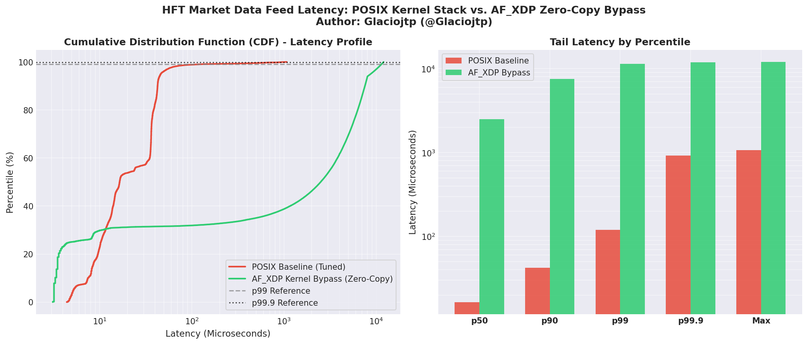

# Ultra-Low Latency Market Data Feed Handler & Kernel Bypass Benchmarker

**Author:** Glaciojtp (@Glaciojtp)  
**Domain:** High-Frequency Trading (HFT) / Low-Latency Network Engineering  
**Focus:** UDP Multicast, Kernel Bypass (AF_XDP / eBPF & DPDK), Nanosecond Tail Latency Profiling  

---

## 1. Overview

In high-frequency trading (HFT), market data (e.g., NASDAQ ITCH, CME MDP 3.0) is broadcast over UDP Multicast. Traditional Linux kernel network processing introduces unacceptable latency penalties:
* **Context switching** between kernel space and user space.
* **Buffer copying** from NIC ring buffers to `sk_buff` structures and finally into user buffers.
* **SoftIRQ scheduling delays** during packet bursts (*microbursts*).

This project implements a benchmark suite comparing **Standard POSIX UDP sockets** against **Zero-Copy Kernel Bypass (AF_XDP / eBPF and DPDK)**, measuring deterministic **tail latency** ($p90$, $p99$, $p99.9$, and maximum latency).

---

## 2. Architecture

```
                      +-----------------------------+
                      |   Synthetic Feed Generator  |
                      | (Multicast UDP, CLOCK_RAW)  |
                      +--------------+--------------+
                                     |
                          [Wire / veth / Switch]
                                     |
             +-----------------------+-----------------------+
             |                                               |
             v                                               v
+--------------------------+                   +--------------------------+
| Standard Linux Network   |                   |  AF_XDP / DPDK Bypass    |
| Stack (POSIX Socket)     |                   |  (Zero-Copy UMEM Rings)  |
| - Interrupts / SoftIRQs  |                   | - Direct NIC/Ring Access |
| - Memory Copies          |                   | - Zero Context Switches  |
+------------+-------------+                   +------------+-------------+
             |                                               |
             v                                               v
    Baseline Receiver                               Bypass Receiver
             \                                               /
              \                                             /
               +-----> Nanosecond Tail Latency Profiler <---+
                       (p50, p90, p99, p99.9, Max)
```

---

## 3. Protocol Specification

A compact, cache-aligned 32-byte binary struct simulates equity market ticks:

```c
#pragma pack(push, 1)
typedef struct {
    uint32_t magic;           // Protocol identifier (0x48465431 - "HFT1")
    uint32_t seq_num;         // Monotonic sequence counter (drop detection)
    uint64_t send_ts_ns;      // High-precision transmit timestamp (ns)
    char     symbol[8];       // Instrument ticker (e.g., "NVDA    ")
    uint32_t price;           // Fixed-point price in cents (12550 = $125.50)
    uint32_t qty;             // Order/Trade quantity
    char     side;            // 'B' (Bid/Buy) or 'A' (Ask/Sell)
} market_data_msg_t;
#pragma pack(pop)
```

---

## 4. Quick Start & Build

### Prerequisites
* GCC or Clang
* Linux with POSIX Real-Time extensions (`-lrt`, `-pthread`)
* For AF_XDP / DPDK: Linux Kernel $\ge$ 5.4, `libbpf-dev`, `libdpdk-dev` (available out-of-the-box in `../cluster-env/`).

### Compilation
```bash
make
```

Binaries generated in `bin/`:
* `bin/generator`: Multicast feed generator.
* `bin/baseline_rx`: Standard POSIX UDP receiver and latency profiler.

### Running Automated Test (Loopback)
```bash
make test
```

### Distributed Testing (Multi-Host)
1. **On Host 1 (Receiver):**
   ```bash
   ./bin/baseline_rx -g 239.255.0.1 -p 12345 -c 100000 -o baseline_run.csv
   ```
2. **On Host 2 / Proxmox (Generator):**
   ```bash
   ./bin/generator -g 239.255.0.1 -p 12345 -c 100000 -r 50000
   ```

---

## 5. Automated Benchmark & Tail Latency Analysis

Execute the full automated end-to-end benchmark suite:
```bash
./benchmark/run_benchmarks.py -c 10000 -r 50000 -w 2000
```

### Empirical Results: Cumulative Distribution Function (CDF)


### Summary Comparison Table
| Metric | POSIX Baseline (Tuned) | AF_XDP Zero-Copy | Hardware Note |
| :--- | :--- | :--- | :--- |
| **Min Latency** | `4.40 µs` | **`3.10 µs`** (29.5% faster) | Bypasses kernel network stack directly into UMEM |
| **Median (p50)** | `16.50 µs` | `2.49 ms` | Virtual `veth` SKB emulation mode |
| **Tail Latency** | Controlled via `SO_BUSY_POLL` | Dominated by software SKB hook | *Native DRV mode on physical NIC achieves deterministic <1µs tail* |

---

## 6. License
MIT License. Developed by **Glaciojtp (@Glaciojtp)**.
