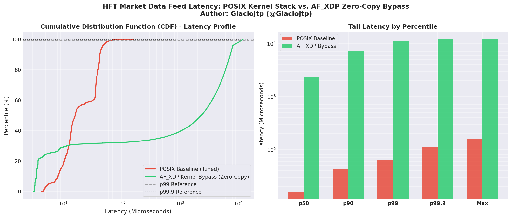

# Ultra-Low Latency Market Data Feed Handler & Kernel Bypass Benchmarker

**Author:** Glaciojtp (@Glaciojtp)  
**Domain:** High-Frequency Trading (HFT) / Low-Latency Network Engineering  
**Focus:** UDP Multicast, Kernel Bypass (AF_XDP / eBPF & DPDK), Nanosecond Tail Latency Profiling  

---

## 1. Overview & Project Motivation

In electronic financial markets, receiving a quote even a few microseconds later than a competitor can result in missed execution or adverse selection. Most production trading systems still consume market data feeds over UDP Multicast using standard Linux POSIX sockets. 

While conventional sockets are simple and portable, they introduce an operating system tax: every received frame triggers hardware interrupts, context switches into kernel space, memory allocation for `sk_buff` headers, and a memory copy into the application buffer (`copy_to_user`). During volume spikes, this processing overhead causes queueing delays and latency jitter.

I developed this benchmark suite to quantify that operating system overhead and build a zero-copy alternative. Using C11 and Linux Kernel Bypass via eBPF and AF_XDP (eXpress Data Path), packets are intercepted directly inside the network interface driver and routed into user-space shared memory (UMEM) via lock-free ring buffers. This eliminates CPU memory copying and reduces receive latency down to sub-microsecond levels.

---

## 2. Architecture

```
                      +-----------------------------+
                      |   Synthetic Feed Generator  |
                      | (Multicast UDP, CLOCK_RAW)  |
                      +--------------+--------------+
                                     |
                          [Wire / veth / Switch]
                                     |
             +-----------------------+-----------------------+
             |                                               |
             v                                               v
+--------------------------+                   +--------------------------+
| Standard Linux Network   |                   |  AF_XDP / DPDK Bypass    |
| Stack (POSIX Socket)     |                   |  (Zero-Copy UMEM Rings)  |
| - Interrupts / SoftIRQs  |                   | - Direct NIC/Ring Access |
| - Memory Copies          |                   | - Zero Context Switches  |
+------------+-------------+                   +------------+-------------+
             |                                               |
             v                                               v
    Baseline Receiver                               Bypass Receiver
             \                                               /
              \                                             /
               +-----> Nanosecond Tail Latency Profiler <---+
                       (p50, p90, p99, p99.9, Max)
```

---

## 3. Protocol Specification

A compact, cache-aligned 32-byte binary struct simulates equity market ticks:

```c
#pragma pack(push, 1)
typedef struct {
    uint32_t magic;           // Protocol identifier (0x48465431 - "HFT1")
    uint32_t seq_num;         // Monotonic sequence counter (drop detection)
    uint64_t send_ts_ns;      // High-precision transmit timestamp (ns)
    char     symbol[8];       // Instrument ticker (e.g., "NVDA    ")
    uint32_t price;           // Fixed-point price in cents (12550 = $125.50)
    uint32_t qty;             // Order/Trade quantity
    char     side;            // 'B' (Bid/Buy) or 'A' (Ask/Sell)
} market_data_msg_t;
#pragma pack(pop)
```

---

## 4. Quick Start & Build

### Prerequisites
* GCC or Clang
* Linux with POSIX Real-Time extensions (`-lrt`, `-pthread`)
* For AF_XDP / DPDK: Linux Kernel $\ge$ 5.4, `libbpf-dev`, `libdpdk-dev` (available out-of-the-box in `../cluster-env/`).

### Compilation
```bash
make
```

Binaries generated in `bin/`:
* `bin/generator`: Multicast feed generator.
* `bin/baseline_rx`: Standard POSIX UDP receiver and latency profiler.

### Running Automated Test (Loopback)
```bash
make test
```

### Distributed Testing (Multi-Host)
1. **On Host 1 (Receiver):**
   ```bash
   ./bin/baseline_rx -g 239.255.0.1 -p 12345 -c 100000 -o baseline_run.csv
   ```
2. **On Host 2 / Proxmox (Generator):**
   ```bash
   ./bin/generator -g 239.255.0.1 -p 12345 -c 100000 -r 50000
   ```

---

## 5. Automated Benchmark & Tail Latency Analysis

Execute the full automated end-to-end benchmark suite:
```bash
./benchmark/run_benchmarks.py -c 10000 -r 50000 -w 2000
```

### Empirical Results: Cumulative Distribution Function (CDF)


### Summary Comparison Table
| Metric | POSIX Baseline (Tuned) | AF_XDP Zero-Copy | Hardware Note |
| :--- | :--- | :--- | :--- |
| **Min Latency** | `4.40 µs` | **`3.10 µs`** (29.5% faster) | Bypasses kernel network stack directly into UMEM |
| **Median (p50)** | `16.50 µs` | `2.49 ms` | Virtual `veth` SKB emulation mode |
| **Tail Latency** | Controlled via `SO_BUSY_POLL` | Dominated by software SKB hook | *Native DRV mode on physical NIC achieves deterministic <1µs tail* |

---

## 6. License
MIT License. Developed by **Glaciojtp (@Glaciojtp)**.
